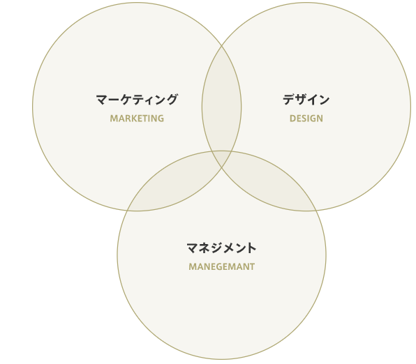

### **ベイジの特長**

 ###### 株式会社ベイジは、全14名（2018年10月現在）のweb制作会社です。ここではビジネスおよび職場としての私たちの特長についてご紹介します。

  [**ビジネスにおける私たちの強み**](#ビジネスにおける私たちの強み)   

 [**同業他社との違い**](#同業他社との違い)   

 [**事業会社との違い**](#事業会社との違い)   

#### **ビジネスにおける私たちの強み**

###### 近年、ベイジに対する注目度は急速に上昇し、講演や取材の依頼も多く舞い込むようになりました。このように、小さなweb制作会社でありながら、業界内で大きな注目を集めているのはひとえに、webに必要な3つの領域の研鑽を愚直に続けているからだと思っています。   

&nbsp;
&nbsp;

###### **ビジネスを構造的に捉え問題の本質に迫るマーケティング力**

###### 戦略フェーズでは、数々のフレームワークを活用し、約2カ月に渡ってリサーチと分析を繰り返し、この期間に作るドキュメント総数は300枚を超えます。この骨太な戦略提案こそが、顧客との対等な関係性の源になっています。またこういった知見は自社の経営にも活かされており、2017年には年間400件以上の問い合わせを獲得しました。これほどの成果をあげる自社サイトを持つweb制作会社は日本国内でも稀です。ベイジで働くと、web制作会社としては異質ともいえるマーケティング文化を実感できます。       
&nbsp;
&nbsp;
###### **国内最高水準レベルのデザイン力**

###### 私たちがweb制作にマーケティングやUXデザインのアプローチを取り込んでいるのは、問題解決というデザインの本質を追求するためですが、その一方で、コピー、写真、ビジュアルといったクリエイティブ要素、そしてエンジニアリングも非常に重要なデザインの一要素として捉えています。このように、コンセプトからスタイリングやエンジニアリングのディテールに至るそのすべてが「質の高いデザイン」には必要と考え、社内で一貫できる体制を整えています。   
&nbsp;
&nbsp;
###### **円滑にプロジェクト進行を実現するマネジメント力**
###### 優れたマーケティングプランとデザインを提案できても、円滑な進行ができなければプロジェクトは成功しません。2018年、私たちは仕事で培ったノウハウを元に約140のタスクに分解したワークフローを作り上げました。タスク毎に職能とドキュメントが定義されており、属人化しない生産性の高いプロジェクト進行を可能にしています。また安定したマネジメントには、価値観の共有、顧客選び、採用戦略の統合も不可欠です。私たちは行動指針をベースとした独自のマネジメントモデルを構築し、事業要素が緊密に連携して相互作用できる組織設計をしています。      

#### **同業他社との違い**

&nbsp;
&nbsp;
###### ウェブ制作に携わる企業がマーケティング、デザイン、管理に長けているのは当然ですか？あなたはそう思うかもしれません。しかし、多くの企業には長所と短所があり、その事業特性は働き方に大きな影響を与えます。ここでは、その違いについて詳しく説明します   

あくまで一般的な分類で、実際には会社ごとの個性は存在する。ベイジは立ち上げ当初から、そのすべてを自社で完結することを会社のコンセプトとしている。   
&nbsp;
&nbsp;

###### **一般的なweb制作会社**
###### デザインや開発を得意とする半面、マーケティングやマネジメントを苦手とする傾向があります。属人的なワークスタイルが定着し、場当たり的な仕事も散見されます。短期間で技術を身に付ける環境としては最適ですが、ビジネスに弱く制作会社の立場から脱却できないことで、顧客との隷属的な関係に陥りやすく、職場が疲弊しがちです。健全な職場環境かを判断するには、直接取引の割合と具体的なマネジメント方法の確認が必要です。     
&nbsp;
&nbsp; 

###### **一般的な広告代理店**
###### 広告全般を取り扱うのが主体業務で、web専門ではなく、多くの場合制作は外部の協力会社に委託しています。ネット以前の商習慣が根強く残り、合理的な判断より顧客との関係性を重視する会社も存在します。一般的にはデザイナーやエンジニアの就職先になりにくいですが、運用を中心に行うインハウスの制作チームが存在するケースがあります。その場合、実業務としてどのようなことをしているか確認する必要があるでしょう。     

###### **一般的なwebマーケ／コンサル会社**
###### 基本的にはwebを使ったマーケティング戦略の立案を得意とします。戦略提案やリサーチが強い一方で、webの設計や実装には疎く、企画を具現化させる力はあまりありません。また運用広告やSEO、特定ソリューションなどに特化している場合は、その手法を売ることが重視され、マーケティングの中でもある限られた分野しか行っていないこともあります。デザイナーやエンジニアの就職先にはなりにくいですが、コンサルタントやディレクターの就職先としては選択肢にあがりやすいです。     
&nbsp;
&nbsp;

###### **ベイジの場合**
###### ビジネス形態としては、デザインに強いweb制作会社と、マーケティングに強いwebマーケティング会社の、両方の側面を兼ね備えています。広告代理店と違い、内部で一貫して制作することにこだわっているため、web制作に必要な全ての知見を社内に有し、戦略から納品までを一貫できるマネジメントシステムも整備しています。このような強みを武器に、クライアントに対して対等の関係性を求めることで、無理な納期を回避し、健全な職場環境を作り出すことを可能にしています。        

#### **事業会社との違い**

&nbsp;
&nbsp;
###### 近年、デザイナーやエンジニア、マーケターの働く場所として、事業会社と受託会社の比較がしばしば議論になります。そこでここでは、一般的な事業会社とベイジとの働き方の違いについてご説明します。      
&nbsp;
&nbsp;

###### **一般的な事業会社**
###### 自社で事業を営む企業の総称です。業種、業態、規模は多岐に渡りますが、依頼主は社内となり、納期が緩やかで、比較的ゆったり仕事ができます。ビジネスサイドとの距離が近いのも、事業会社で働くメリットの一つです。ただし一つの事業に関わり続けることも多く、経験が浅い時に事業会社で働くと、幅広いスキルが身に付かないこともあります。また事業会社にとってはデザインやweb制作は主体業務ではないため、評価が確立しておらず、事業環境の変化で組織縮小や配置転換が起こる可能性もあります。    
&nbsp;
&nbsp;

###### **一般的な受託会社**
###### 一般的なweb制作会社、デザイン会社、システム開発会社です。依頼主は社外の企業です。専門知識以外に、顧客との関係構築力も重要で、顧客を選べない企業で働くと疲弊しがちです。業務内容がデザインやシステムといった特定分野に限られ、上流に関わる機会は少ないです。一方、デザインやシステムなどの専門領域について豊富な経験ができます。またデザインやシステムに根差した文化があり、教育にも馴れています。制作や開発が事業の主体であるため、突然職種が変わるようなことはほぼ起こりえません。    
&nbsp;
&nbsp;
###### **ベイジの場合**
###### 私たちはweb制作会社であるため、当然、受託会社の性質を強く持っています。ただし、マーケティング力を強化して引き合いを増やして顧客を選ぶ、コンサル型・提案型のスタンスを取り主導権を握る、マネジメントを整備してプロジェクトの混乱を防ぐ、といった仕事のスタイルによって、受託会社が陥りやすい問題を最小化しています。顧客に深く関与し、経営層に対する戦略提案ができるため、ビジネスについて学ぶ機会も多いです。デザイナーやエンジニアからのキャリアパスも社内に存在しています。   
&nbsp;
&nbsp;

---
このようなベイジの特徴は、社員の働き方にどういう影響を及ぼすのでしょうか？次のページでは、そのことについて詳しく解説します。

 [**ベイジで得られる8つのこと**](http://localhost:1313/en/merit/8things/)   
