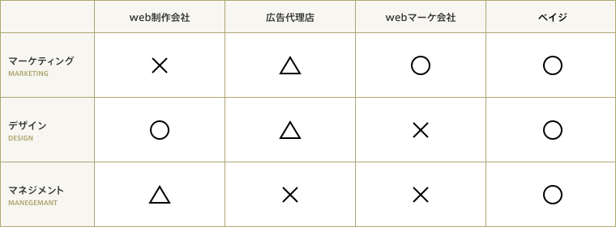

### **アンダーズの特徴**

 ###### グローバルなIT技術を、国境を越えて駆使している当社。各国の優秀な人材が加わることで、さまざまなシナジーがもたらされます。

  [**ITの先頭をひた走る英語圏の技術を日本語で提供**](#ITの先頭をひた走る英語圏の技術を日本語で提供)   

 [**多国籍メンバーのチームが適材適所で強みを発揮**](#多国籍メンバーのチームが適材適所で強みを発揮)   

 [**働く場所を分散させることで得られる恩恵**](#働く場所を分散させることで得られる恩恵)   

#### **ITの先頭をひた走る英語圏の技術を日本語で提供**

###### 英語圏には世界中から優秀な技術者が集まってきます。Google、Amazon、Facebook、Apple、そしてMicrosoft。世界を席巻するこれらの5大企業もすべてアメリカ発の会社です。また英語を母国語に持つ人々は、幼少期から英語で書かれたプログラミング言語などITの知識を学べる環境に恵まれ、第一線で活躍できる人材が育ちやすいとも言われています。私たちは、そんな日々新しい技術が生み出されている海外のITノウハウを日本語で提供。日本にまだ浸透していないグローバルな最新技術を取り入れたサービスを生み出しています。   

<!--  -->



&nbsp;
&nbsp;    

#### **多国籍メンバーのチームが適材適所で強みを発揮**
&nbsp;
&nbsp;
###### アンダーズは日本、インド、ミャンマー、ベトナムの多国籍メンバーで構成されています。国際色豊かなチームでシステム開発に取り組むことで、一人ひとりが得意な分野に特化することができます。たとえば、技術開発はインド人が強みを最大限に発揮できる仕事のひとつ。またクライアントとのコミュニケーションは、お辞儀の文化が根付くミャンマー人や日本人の持ち場です。またベトナム人は、偏りが少なく比較的マルチに対応できるタイプ。このように、それぞれの強みを活かすことで適材適所の活躍、すなわち「スキルの最適化」が叶います。 
  

<!--  -->


    

#### **働く場所を分散させることで得られる恩恵**

&nbsp;
&nbsp;
###### 従業員は日本とインドに分散して仕事をしています。というのも、ソフトウェア開発は離れていてもデータを一瞬で送ることができるので、わざわざ同じ空間で働く必要がないのです。またそれぞれが母国に暮らしながら仕事ができますし、日本よりも生活物価の低い地域で暮らすほうが、コストを抑えられるという利点もあります。      
&nbsp;
&nbsp;

###### **×一般的な事業会社**
###### ×自社で事業を営む企業の総称です。業種、業態、規模は多岐に渡りますが、依頼主は社内となり、納期が緩やかで、比較的ゆったり仕事ができます。ビジネスサイドとの距離が近いのも、事業会社で働くメリットの一つです。ただし一つの事業に関わり続けることも多く、経験が浅い時に事業会社で働くと、幅広いスキルが身に付かないこともあります。また事業会社にとってはデザインやweb制作は主体業務ではないため、評価が確立しておらず、事業環境の変化で組織縮小や配置転換が起こる可能性もあります。    
&nbsp;
&nbsp;

###### **×一般的な受託会社**
###### ×一般的なweb制作会社、デザイン会社、システム開発会社です。依頼主は社外の企業です。専門知識以外に、顧客との関係構築力も重要で、顧客を選べない企業で働くと疲弊しがちです。業務内容がデザインやシステムといった特定分野に限られ、上流に関わる機会は少ないです。一方、デザインやシステムなどの専門領域について豊富な経験ができます。またデザインやシステムに根差した文化があり、教育にも馴れています。制作や開発が事業の主体であるため、突然職種が変わるようなことはほぼ起こりえません。    
&nbsp;
&nbsp;
###### **×ベイジの場合**
###### ×私たちはweb制作会社であるため、当然、受託会社の性質を強く持っています。ただし、マーケティング力を強化して引き合いを増やして顧客を選ぶ、コンサル型・提案型のスタンスを取り主導権を握る、マネジメントを整備してプロジェクトの混乱を防ぐ、といった仕事のスタイルによって、受託会社が陥りやすい問題を最小化しています。顧客に深く関与し、経営層に対する戦略提案ができるため、ビジネスについて学ぶ機会も多いです。デザイナーやエンジニアからのキャリアパスも社内に存在しています。   
&nbsp;
&nbsp;

---
×このようなベイジの特徴は、社員の働き方にどういう影響を及ぼすのでしょうか？次のページでは、そのことについて詳しく解説します。


