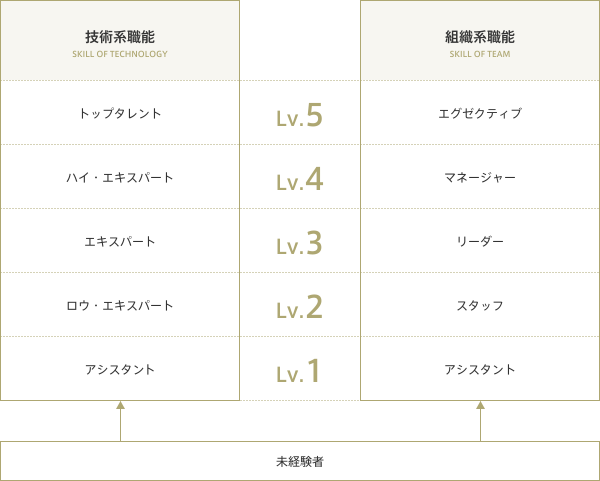

### アンダーズについて

**「アンダーズ」とはヒンディー語で「パーソナルスタイル」という意味。従業員一人ひとりの「らしさ」が輝く仕事をしてほしいという願いを社名に込めました。** 

[**&nbsp; インド人の高い技術力を日本のビジネスに活かしたい。**](#インド人の高い技術力を日本のビジネスに活かしたい。)

[**&nbsp; エンジニアが「面白い」と感じられる仕事をしよう。**](#エンジニアが「面白い」と感じられる仕事をしよう。)

[**&nbsp; 社会貢献の前に、従業員ファースト**](#社会貢献の前に、従業員ファースト)

[**&nbsp; 今後は約100名体制まで増員を予定**](#今後は約100名体制まで増員を予定)

[**&nbsp; スタッフのキャリアパス**](#スタッフのキャリアパス)

#### インド人の高い技術力を日本のビジネスに活かしたい。

アンダーズ誕生のきっかけは、代表が滞在していたインド・ムンバイでの経験にさかのぼります。現場で活躍するインド人の技術力の高さに感動し、彼らの能力を日本のビジネス強化に活かせないかと考えました。そこで日本に戻り、2016年にアンダーズを設立。現在はインド国内で約20名、日本国内では日本人と外国人が12名在籍し、主に英語ですが部門によってはリアルタイム翻訳ツールを活用しながらコミュニケーションを行っています。    
  
＜年表（※仮の状態です）＞     
2011年　代表・新井が渡印。インドの技術力に感銘を受ける   
2016年　アンダーズ株式会社設立   
●●●●年　マイクロソフトネットワークパートナー認定取得  
●●●●年　マイクロソフトシルバーパートナー認定取得  
●●●●年　マイクロソフトゴールドパートナー認定取得  
●●●●年　本社を虎ノ門から麹町へ移転  
2019年　増資  
2021年　ISO取得  

#### エンジニアが「面白い」と感じられる仕事をしよう。
月給をもらうために上司の話を黙って聞いて、言われた通りに仕事をする時代ではもうありません。それに自分が納得できない仕事は、生命の維持のためにやる必要がないと考えます。お客様であっても、ビジネスを一緒に作り上げていくメンバーとして尊重してくださっているため、ワクワクできるプロジェクトに携わることができるでしょう。たとえば、**AI技術やビッグデータ、IoTなどの新しいテクノロジーが使えたり、新規サービスのプロジェクト開発に携われたり**。エンジニアにとって、**価値がある仕事**を選定しています。

#### 社会貢献の前に、従業員ファースト
また、頻繁に報告を求める方や、細かい指示の多い方とのお付き合いは控えめにしています。 大切にしているのは、**対等な関係が作れること、こちらの知見や工夫が活かせること、そしてどこでも活躍できるスキルが身につくこと**。信頼して任せていただけるお客様なら、エンジニアの血肉になる仕事ができると考えています。私たちは社会貢献といった大きな夢を語る前に、まずは従業員ファーストでありたい。技術が大好きなみなさんが、ワクワクする環境づくりを心がけています。

#### 今後は約100名体制まで増員を予定  

社内の体制としては、**今後100名前後まで従業員の増員**を計画しています。100名に近づいてきたら、その後は他社との資本提携といった可能性も含めて次のステージを計画していく予定です。インド在住のスタッフは「インドでの暮らし」を大切にしながら働くフルリモートですが、場合によっては研修などで日本に出張する機会もあるでしょう。

#### スタッフのキャリアパス

<!--     -->


---

×こういった私たちの将来像や社員のキャリアパスを実現するためには、日々の行動の積み重ねと、価値観の共有・醸成が必要です。その価値観を明文化したのが、私たちが持っている2つの行動指針です。


